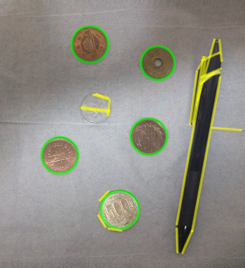

# image_proc_trial

Trial implementation of image processing

## 1. ファイル構成

| ディレクトリ,ファイル | 説明 |
|---|---|
| proc_ransac_py/ | RANSAC実装（画像から直線、円検出）（python版） |
| proc_ransac_py/main.py | 直線,円を1つずつ検出 |
| proc_ransac_py/main2.py | 複数まとめて検出 |
| proc_ransac_py/fig.py | 共通モジュール（直線、円クラスの定義等） |
| proc_ransac_py/debug.py | デバッグ |
| proc_ransac_c/ | RANSAC実装（画像から直線、円検出）（C++版） |
| proc_ransac_c/src/main.cpp | 直線,円を1つずつ検出 |
| proc_ransac_c/src/main2.cpp | 複数まとめて検出 |
| proc_ransac_c/src/fig.cpp | 共通モジュール（直線、円クラスの定義等） |
| proc_ransac_c/src/debug.cpp | デバッグ |
| data/ | テスト用画像データ |
| data/test_img.jpg | RANSAC実装（画像から直線、円検出）のテスト画像 |


## 2. 環境構築

※WSL2 Ubuntu24.04で動作実績あり

### 2.1 python環境

仮想環境を構築し、opencvをインストールします。

```shell
python3 -m venv .venv --prompt [任意名]
source .venv/bin/activate

pip install opencv-python
```

### 2.2 c++環境

cmake, opencvをインストールします。

```shell
sudo apt install build-essential cmake pkg-config libopencv-dev
```

## 3. 実行方法

### 3.1 RANSAC実装（python版）
 
proc_ransac_py/main.py または、main2.pyを実行します。output_py or output_py2ディレクトリ以下にログ出力されます。

```shell
python proc_ransac_py/main.py [画像ファイル]
```

実行結果例



### 3.2 RANSAC実装（C++版）

ビルド後に、```proc_ransac_c.elf```を実行します。output_cpp or output_cpp2ディレクトリ以下にログ出力されます。

```shell
mkdir build
cd build
cmake ..
make

proc_ransac_c/proc_ransac_c.elf [画像ファイル]
```

※実行結果例は省略（python版と同様）
